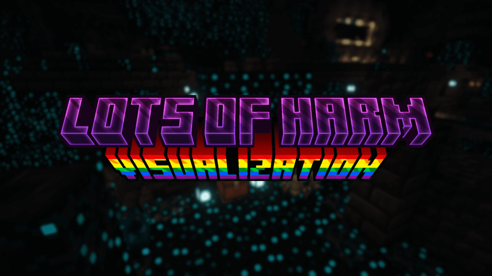

# Lots of Harm Visualization

语言：| [English](README.md) | > 简体中文 < |

## ❗ 注

- 本模组，尤其是字符动画，深受游戏《绝区零》启发。如有任何侵权问题，请联系我，我将第一时间处理。

## 📌 前置

需要Fabric API、YACL作为前置。
已兼容Modmenu，可以通过Modmenu配置本模组。
规划联动无尽贪婪、起源、MmmMmmMmmMmm。

## 📑 介绍

WIP

## 💭 FAQ

Q: 其他 Minecraft 版本？
A: 规划更新至更多主流版本，鼓励第三方移植，如有强烈需求可以提交issue。

Q: Forge/neoForge/Quilt 版本？
A: 目前没有这样的打算，但鼓励第三方移植。

## ℹ️ 其他

- en_us、zh_hk、zh_tw使用AI翻译，如有问题请提交issue或PR。